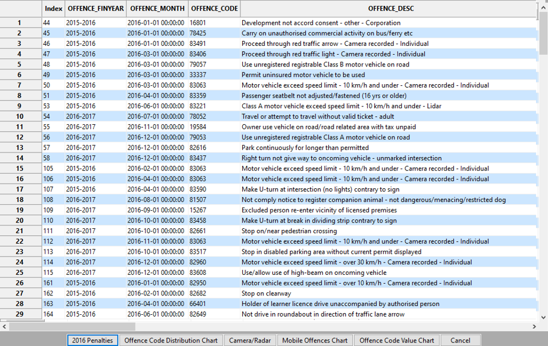
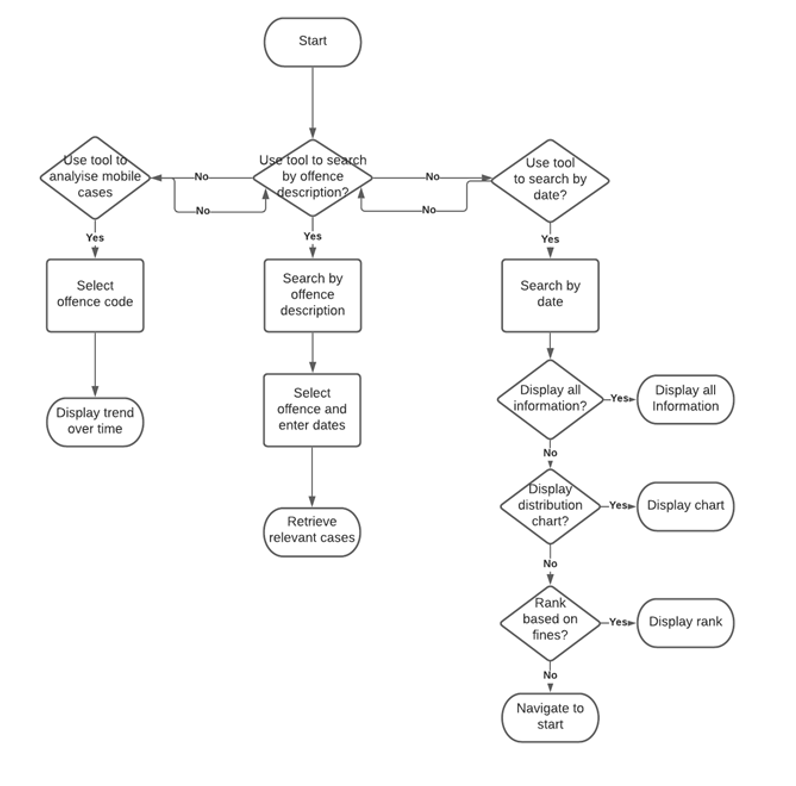
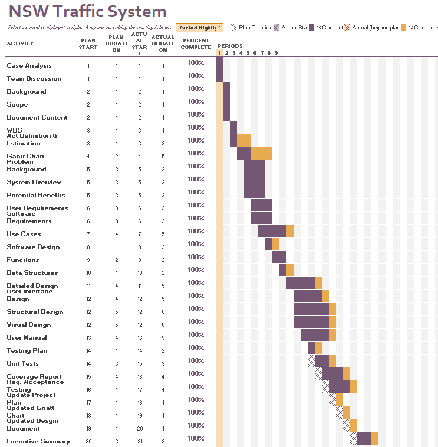

# 2810ICT Software Technologies | Data Analysis and Visualisation

The assigned group-based project requires the completion of simple data analysis and visualisation through a graphical user interface.
The subject of this task is a hand-picked dataset; Australian NSW Traffic Penalty data 2012 – 2017. The project consists of two phases: design and implementation.

The design element of this task consists of producing a project plan, which includes: a Project Overview, Work-Breakdown Structure, Activity Definition and Estimation, and a Gantt chart. The project plan will be used to define our goals and objectives by creating an overview and a work-breakdown structure, which will subsequently define our activities. A Gantt chart will be utilised for the scheduling and time estimation of tasks. A Software Design Document will be developed containing a Systems Vision Statement, a formal list of Software Requirements, Use Cases, System Components, Software Design, and an early Interface Design.

| Login Screen                                           | Teacher Screen                                              | Another Screen                                              |
|--------------------------------------------------------|-------------------------------------------------------------|-------------------------------------------------------------|
|  |  |  |

The implementation process will be determined based on the design created in the first phase. Before implementation, a testing plan will be formulated to thoroughly test various components of the system.
Upon completion of testing a report will be made to process the results alongside a user manual that will explain how to use the software and show it features.
To finish the implementation phase, an executive summary will be utilized to present the data over a 12-month period.
